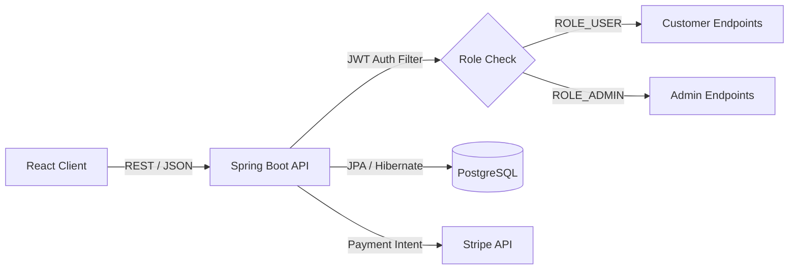

# 🛍️ Stickora – Decorative Stickers E-Commerce Platform

> **Stickora** is a full-stack, enterprise-grade e-commerce web application engineered for browsing, purchasing, and managing decorative stickers. Built with a modern decoupled architecture, it features secure token-based authentication, role-based authorization, seamless Stripe payment gateway integration, and a fully responsive user interface.

---

## 🚀 Live Demo & Links

* **Live Demo:** [View Live Demo](https://stickora-store.vercel.app/)
  
---

## 📌 Features

### 👤 Customer Features
* **User Authentication & Authorization:** Secure registration and login powered by JWT (JSON Web Tokens) and BCrypt password hashing.
* **Catalog Browsing:** Explore a wide variety of decorative stickers with dynamic search and filtering capabilities.
* **Product Details:** In-depth view of individual stickers, pricing, and stock availability.
* **Shopping Cart & Checkout:** Add/remove items, manage quantities, and complete secure checkouts.
* **Payment Integration:** Live test-mode checkout processing via the Stripe Payment Gateway.
* **Responsive UI:** Fully optimized layout across mobile, tablet, and desktop devices.

### 🛠️ Administrator Features
* **Admin Dashboard:** Secure, role-restricted management portal (`ROLE_ADMIN`).
* **Product Catalog Management:** Perform full CRUD operations (Add, Update, Delete products).
* **Inventory Oversight:** Monitor active inventory levels and manage store listings seamlessly.

---

## 🏗️ Tech Stack

* **Frontend:** React.js, Vite, JavaScript, CSS, Axios, React Router DOM
* **Backend:** Java 21, Spring Boot, Spring Security, Spring Data JPA / Hibernate, Maven
* **Database:** PostgreSQL (Hosted on NeonDB)
* **Payment Gateway:** Stripe API
* **Deployment & Hosting:** Vercel (Frontend), Render (Backend)

---
## 📸 Preview

| Home Page (Light Mode) | Home Page (Dark Mode) |
|:---:|:---:|
|  |  |

| Contact Us | About Us |
|:---:|:---:|
|  |  |

| Product Details | Shopping Cart |
|:---:|:---:|
|  |  |

| Checkout | Stripe Payment |
|:---:|:---:|
|  |  |

| Profile | Orders |
|:---:|:---:|
|  |  |

| Admin Order Management | Admin Contact Messages |
|:---:|:---:|
|  |  |

## 🧩 Architecture
 
<!--
Add a real architecture diagram here (e.g. drawn in draw.io, Excalidraw, or Mermaid
exported as PNG) showing: React Client -> REST API (Spring Boot) -> PostgreSQL,
plus JWT filter chain and Stripe as an external service.
Save it to docs/architecture.png and reference it below.
-->
 

  

**Request flow :**
 

 
---

