# 🛍️ Stickora – Decorative Stickers E-Commerce Platform


> **Stickora** is a full-stack, enterprise-grade e-commerce web application engineered for browsing, purchasing, and managing decorative stickers. Built with a modern decoupled architecture, it features secure token-based authentication, role-based authorization, seamless Stripe payment gateway integration, and a fully responsive user interface.

---

## 🚀 Live Demo & Links

* **Live Demo:** [View Live Demo](https://stickora-store.vercel.app/)
  
---

## 📌 Features

### 👤 Customer Features
* **User Authentication & Authorization:** Secure registration and login powered by JWT (JSON Web Tokens) and BCrypt password hashing.
* **Catalog Browsing:** Explore a wide variety of decorative stickers with dynamic search and filtering capabilities.
* **Product Details:** In-depth view of individual stickers, pricing, and stock availability.
* **Shopping Cart & Checkout:** Add/remove items, manage quantities, and complete secure checkouts.
* **Payment Integration:** Live test-mode checkout processing via the Stripe Payment Gateway.
* **Responsive UI:** Fully optimized layout across mobile, tablet, and desktop devices.

### 🛠️ Administrator Features

- **Full User Access:** Inherits all standard user functionalities.
- **Secure Admin Dashboard:** Role-based access restricted to administrators (`ROLE_ADMIN`).
- **Order Monitoring:** View and manage all customer orders.
- **Customer Inquiries:** Review messages submitted through the Contact Us page.
- **Inventory Management:** Maintain product availability and store listings.

---

## 🏗️ Tech Stack

* **Frontend:** React.js, Vite, JavaScript, CSS, Axios, React Router DOM
* **Backend:** Java 21, Spring Boot, Spring Security, Spring Data JPA / Hibernate, Maven
* **Database:** PostgreSQL (Hosted on NeonDB)
* **Payment Gateway:** Stripe API
* **Deployment & Hosting:** Vercel (Frontend), Render (Backend)

---
## 📸 Preview

| Home Page (Light Mode) | Home Page (Dark Mode) |
|:---:|:---:|
| 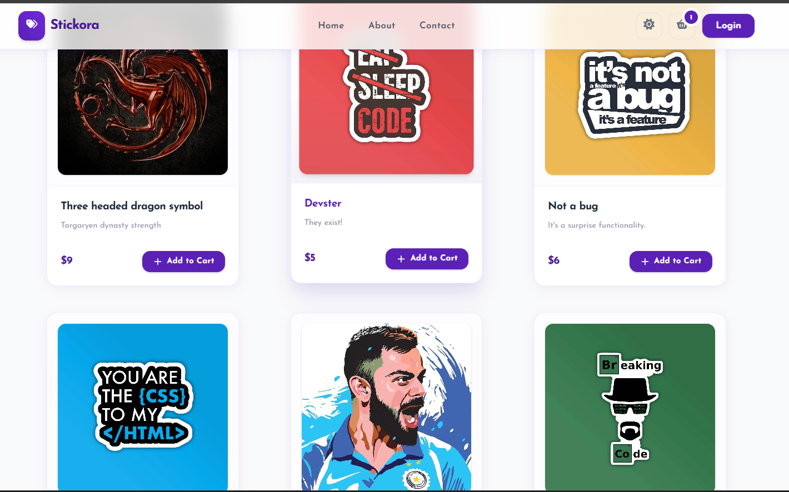 | 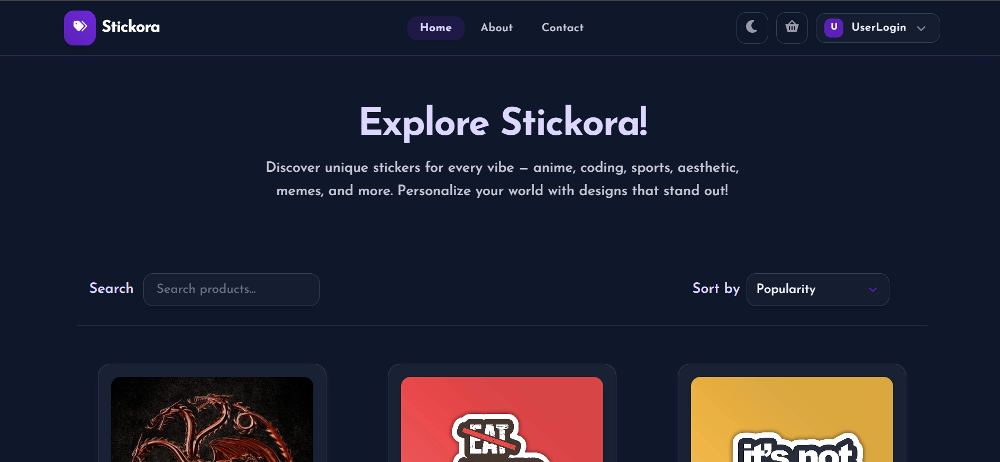 |

| Contact Us | About Us |
|:---:|:---:|
| 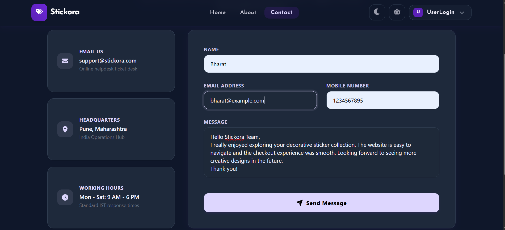 | 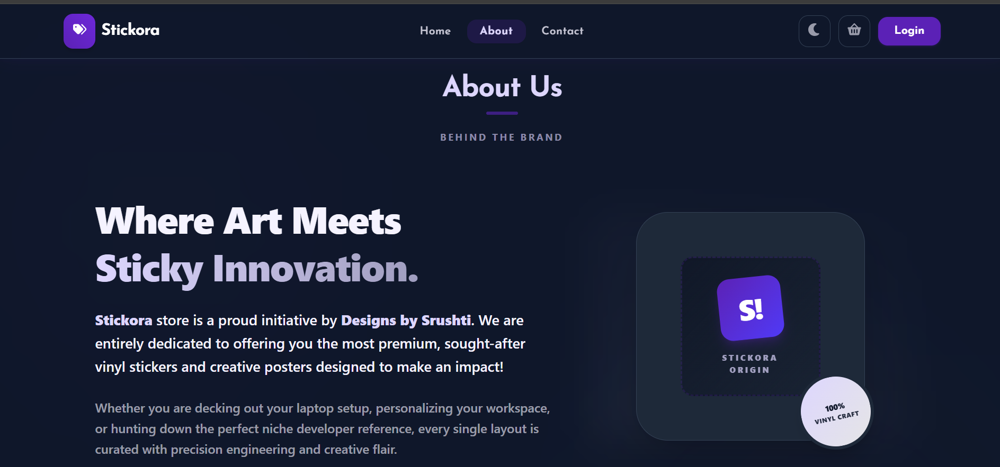 |

| Product Details | Shopping Cart |
|:---:|:---:|
| 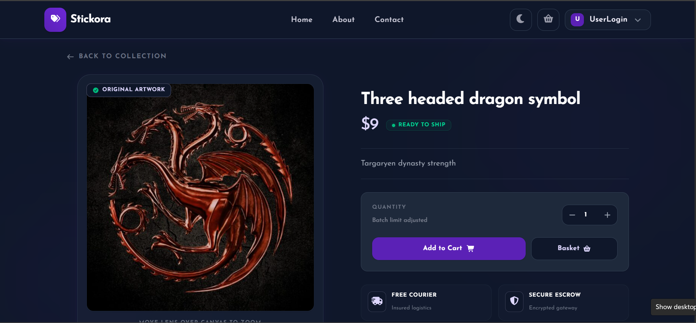 | 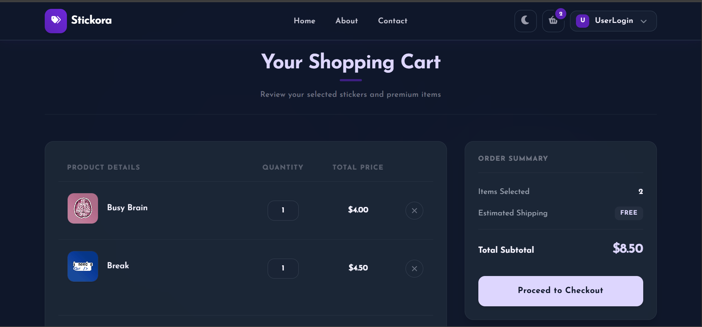 |

| Checkout | Stripe Payment |
|:---:|:---:|
| 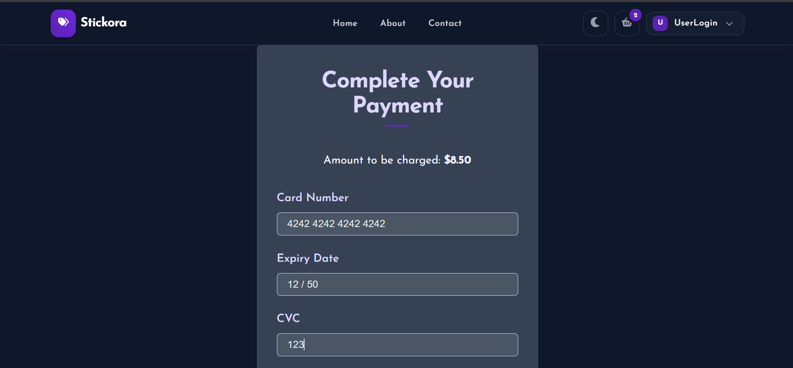 | 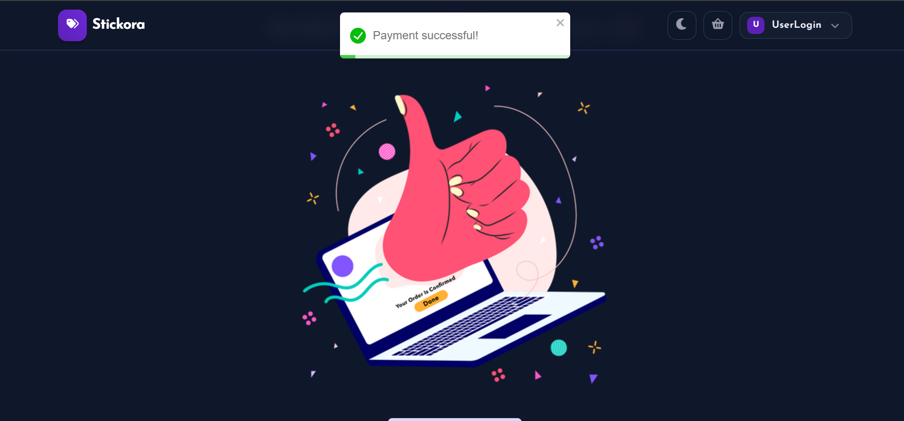 |

| Profile | Orders |
|:---:|:---:|
| 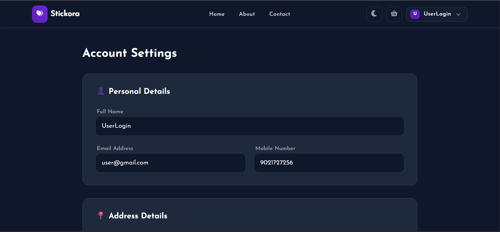 | 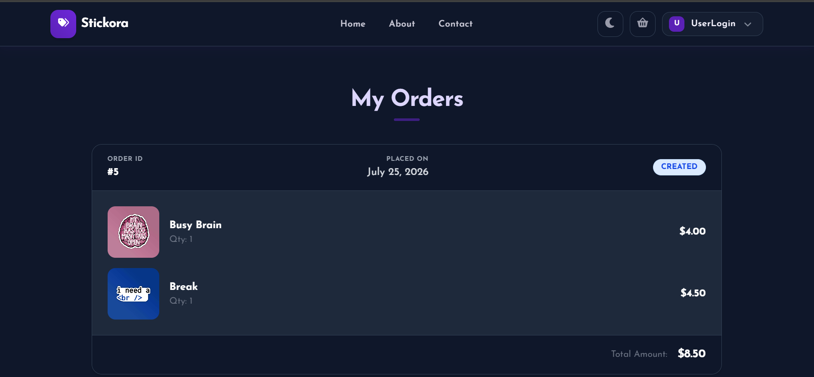 |

| Admin Order Management | Admin Contact Messages |
|:---:|:---:|
| 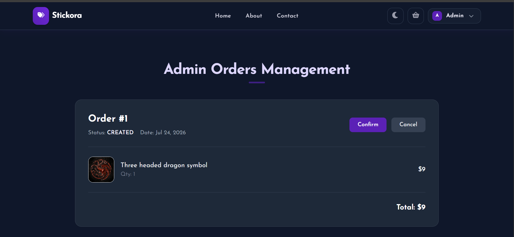 | 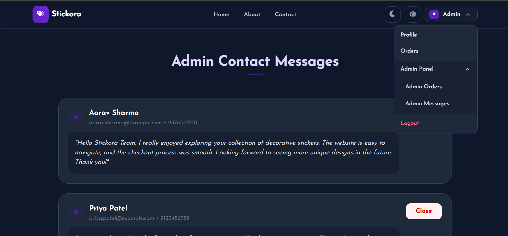 |

## 🧩 Architecture
 
<!--
Add a real architecture diagram here (e.g. drawn in draw.io, Excalidraw, or Mermaid
exported as PNG) showing: React Client -> REST API (Spring Boot) -> PostgreSQL,
plus JWT filter chain and Stripe as an external service.
Save it to docs/architecture.png and reference it below.
-->
 
<div align="center">
  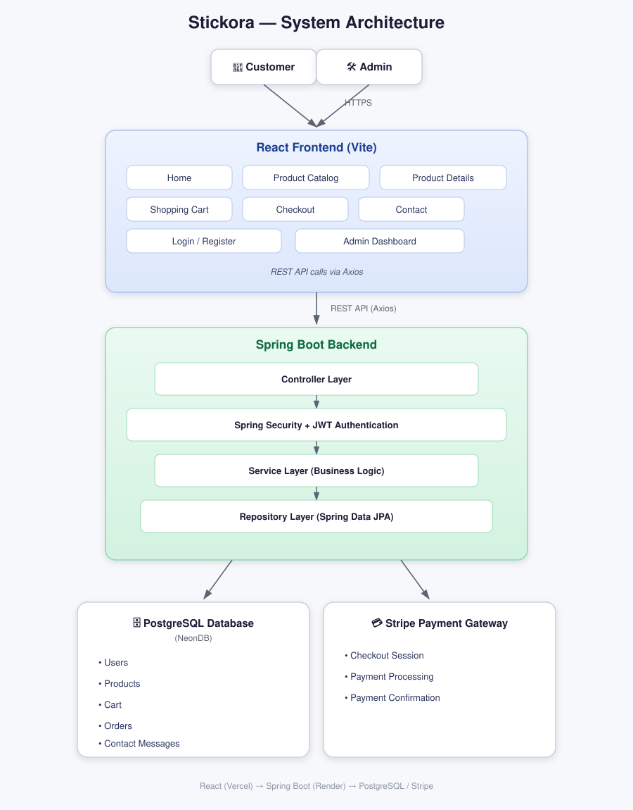
</div>
**Request flow :**
 
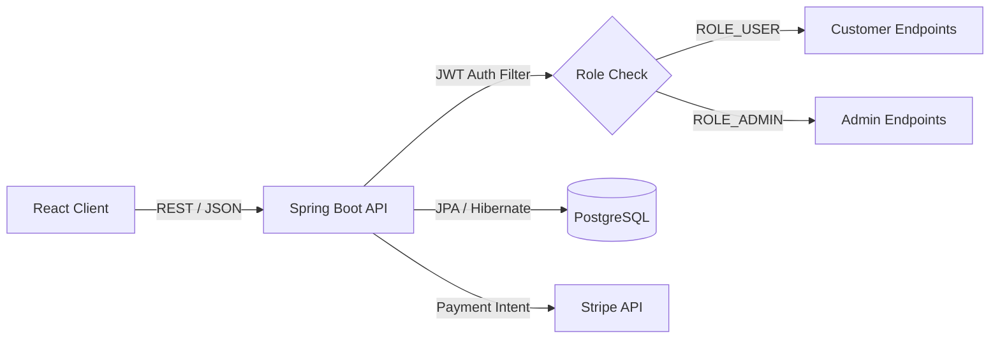
 
---

## ⚙️ Installation & Setup

Follow these steps to run the Stickora project locally.

### 1. Clone the Repository

```bash
git clone https://github.com/Jagtap-Srushti/stickora-store.git
cd stickora-store
```

---

### 2. Backend Setup

Navigate to the backend directory:

```bash
cd Backend/stickora
```

Create a `.env` file (or configure your environment variables) and add the following:

```properties
DB_URL=your_postgresql_database_url
DB_USERNAME=your_database_username
DB_PASSWORD=your_database_password

JWT_SECRET=your_jwt_secret_key

STRIPE_API_KEY=your_stripe_secret_key

FRONTEND_URL=http://localhost:5173
```

Run the backend:

```bash
./mvnw spring-boot:run
```

The backend will start at:

```
http://localhost:8080
```

---

### 3. Frontend Setup

Navigate to the frontend directory:

```bash
cd Frontend
```

Install dependencies:

```bash
npm install
```

Create a `.env` file inside the `Frontend` directory and add:

```properties
VITE_API_BASE_URL=http://localhost:8080
VITE_STRIPE_PUBLISHABLE_KEY=your_stripe_publishable_key
```

Start the development server:

```bash
npm run dev
```

The frontend will be available at:

```
http://localhost:5173
```

---

## 🔑 Environment Variables

### Backend (.env)

| Variable | Description |
|----------|-------------|
| `DB_URL` | PostgreSQL database connection URL |
| `DB_USERNAME` | PostgreSQL username |
| `DB_PASSWORD` | PostgreSQL password |
| `JWT_SECRET` | Secret key used to sign JWT tokens |
| `STRIPE_API_KEY` | Stripe Secret API Key |
| `FRONTEND_URL` | Frontend application URL |

Example:

```properties
DB_URL=jdbc:postgresql://localhost:5432/stickora
DB_USERNAME=postgres
DB_PASSWORD=your_password
JWT_SECRET=your_secret_key
STRIPE_API_KEY=sk_test_xxxxxxxxxxxxxxxxx
FRONTEND_URL=http://localhost:5173
```

---

### Frontend (.env)

| Variable | Description |
|----------|-------------|
| `VITE_API_BASE_URL` | Spring Boot backend API URL |
| `VITE_STRIPE_PUBLISHABLE_KEY` | Stripe Publishable Key |

Example:

```properties
VITE_API_BASE_URL=http://localhost:8080
VITE_STRIPE_PUBLISHABLE_KEY=pk_test_xxxxxxxxxxxxxxxxx
```

---

## ▶️ Running the Application

Start the backend:

```bash
cd Backend/stickora
./mvnw spring-boot:run
```

Start the frontend:

```bash
cd Frontend
npm install
npm run dev
```

Open your browser and visit:

```
http://localhost:5173
```

---

## 🌐 Production Deployment

| Service | Platform |
|---------|----------|
| Frontend | Vercel |
| Backend | Render |
| Database | Neon PostgreSQL |
| Payment Gateway | Stripe |

---
## 🔐 Security

Stickora implements multiple security best practices to protect user data and application resources.

- JWT-based Authentication
- Role-Based Authorization (`ROLE_USER`, `ROLE_ADMIN`)
- BCrypt Password Hashing
- Protected REST APIs using Spring Security
- Secure Stripe Payment Integration
- Environment Variables for Sensitive Credentials

---
## 👩‍💻 Author

**Srushti Jagtap**

Computer Engineering Student

---
